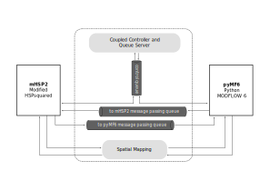

.. _code_doc:

==========================
 Code Documentation
==========================

The code base is composed of two independent programs and a coupled model 
and message passing queue management framework. The two programs and the
manager all execute in independent processes. **Figure** 
:ref:`fig_cd_3procframe` provides a schematic showing the interaction of 
the three independent processes and the components of the coupled 
controller and queue server.

* One independent program is **mHSP2** which provides a Python variant of 
  :abbr:`HSPF (Hydrological Simulation Program – FORTRAN)`.

* The other program is **pyMF6** which provides a Python-wrapped version
  of MODFLOW 6. 

.. _fig_cd_3procframe:

    **pyHS2MF6 framework and queues**

|

|

.. toctree::
    :maxdepth: 2
    :name: codedoctoc 

    cpcontroller.rst
    mHSP2.rst
    pyMF6.rst

