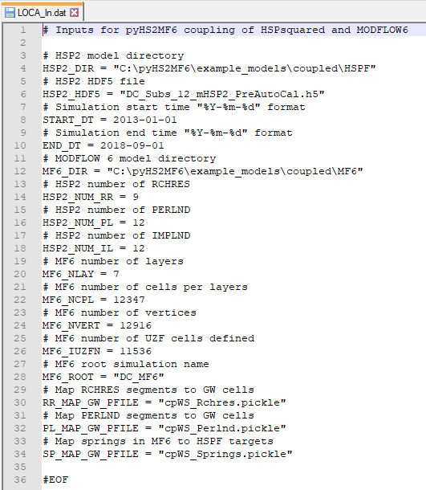
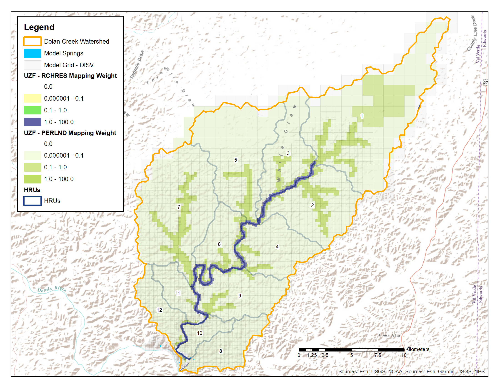
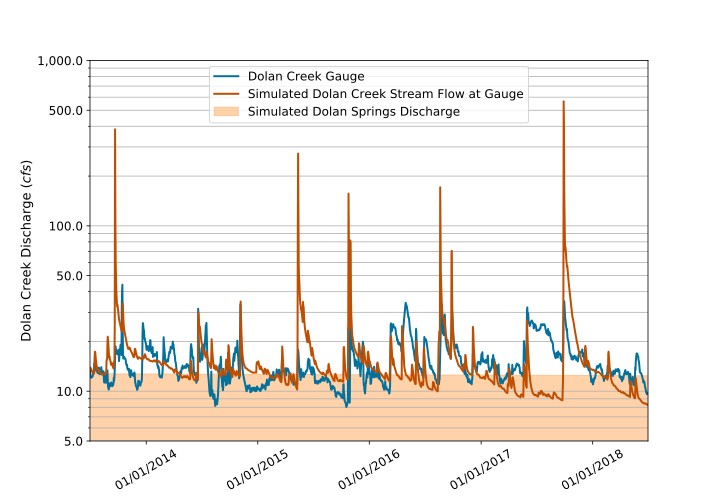
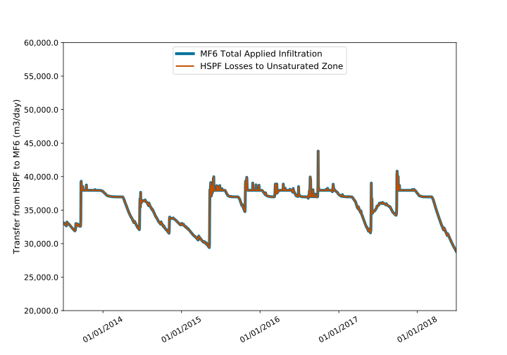
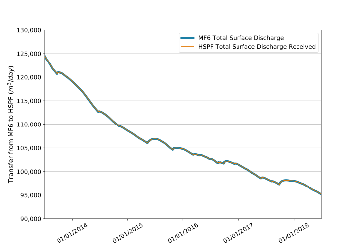

.. _coupled_case_study:

Coupled Mode Simulation and Results
====================================

**pyHS2MF6** was created for coupled mode simulation. The 
:ref:`standalone_HSPF` and :ref:`standalone_MF6` were modified so that
they could be used together as part of a dynamically coupled 
simulation. Dynamic coupling, here, refers to information and water
exchange during each simulation time step.

|

.. caution:: At this time, the only supported coupled time step duration
   is one day. **mHSP2** also only supports a one day time step. 
   **pyMF6**, however, supports all time step durations which are 
   supported by MODFLOW 6. The source code for **mHSP2** is available
   and so the savvy user can easily extend **mHSP2** to work with 
   additional time step durations.

|

.. _cp_mods_inputs:

Coupled Mode Modifications and Inputs 
--------------------------------------

For a coupled mode simulation, the standalone HSPF and 
MODFLOW 6 models need to be modified so that **pyHS2MF6** can send 
information back and forth between the two independent processes. 
Additionally, a special coupled mode input file needs to be created.

|

.. _cp_HSPF_mods:

HSPF Model Modifications for Coupling
~~~~~~~~~~~~~~~~~~~~~~~~~~~~~~~~~~~~~~~

Only minimal modifications to the standalone HSPF model are needed. 
The external time series that provides for spring discharge, or baseflow,
to Reach #5 (see **Figure** :ref:`fig_cs_sahspf_calib`) needs to be removed 
from the HSPF input file. In coupled mode, the simulated spring discharge 
from from Dolan Springs and YR-70-01-701 (see **Figure** 
:ref:`fig_cs_watershed`) from the MODFLOW 6 model are provided to Reach #5 in 
the HSPF model as transferred water as part of the dynamic coupling.

The Jupyter Notebook `mHSP2_Mods_SAtoCP <https://github.com/nmartin198/pyHS2MF6/blob/master/example_models/jupyter_notebooks/mHSP2_Mods_SAtoCP.ipynb>`_ 
provides an example of removing an external time series inflow from 
a **mHSP2** input file.

|

.. _cp_MF6_mods:

MODFLOW 6 Model Modifications for Coupling
~~~~~~~~~~~~~~~~~~~~~~~~~~~~~~~~~~~~~~~~~~~~

More extensive modifications to the standalone MODFLOW 6 model are 
required to facilitate coupling. This is not surprising as MODFLOW 6 
uses a three-dimensional, computational grid and provides a suite 
of stress and advanced stress packages for simulating many different 
processes. Consequently, a MODFLOW 6 model is relatively complex and 
requires relatively more effort to prepare for coupled mode simulation.

In **pyHS2MF6** only the :abbr:`UZF (Unsaturated Zone Flow)` Package 
cells can receive water from the HSPF model. There are two types of 
water that HSPF sends to MODFLOW 6 :abbr:`UZF (Unsaturated Zone Flow)` 
cells.

1. Deep infiltration out of the bottom of the soil column. In HSPF 
   terminology this water is inactive groundwater inflow (IGWI).

2. River/stream leakage out of the bottom of the stream bed. In HSPF, 
   there is not a preconfigured process for stream losses to groundwater 
   because saturated groundwater conditions are not really represented 
   in HSPF. In **pyHS2MF6**, stream losses from leakage to groundwater are 
   extracted from a RCHRES stream segment through the use of multiple 
   RCHRES exits. For each exit, the discharge through the exit can be 
   routed to a different destination. 

   * One exit must be identified as part of the specifications in the 
     :ref:`cp_spat_map` for each RCHRES which generates losses 
     to groundwater. And, normally one exit is identified to the HSPF 
     model, using mass links and schematic blocks in the HSPF inputs, 
     for routing of water to the next operations structure downstream.

   * In this example model, a volume-based relationship, or FTABLE, is 
     used to calculate losses to groundwater from Reach #1 - #4.
     Reach #5 coincides with Fort Terrett outcrop and so this reach is 
     treated as gaining, only. The losses to groundwater for these four 
     reaches are then a calculated HSPF model solution quantity which 
     leaves the HSPF model. 
   
   * The user could also use a time-based relationship for determining 
     outflows via the losses to groundwater exit. This has never been 
     tested.

Because the :abbr:`UZF (Unsaturated Zone Flow)` Package cells are the only
stress package representation that can receive water from HSPF in 
**pyHS2MF6**, required modifications all involve 
:abbr:`UZF (Unsaturated Zone Flow)` Package cells. These modifications 
are listed below.

* Replace the :abbr:`RIV (River Package)` cells with 
  :abbr:`UZF (Unsaturated Zone Flow)` cells

  - HSPF simulates all surface water and takes the place of the 
    :abbr:`RIV (River Package)` cells in a coupled model.

* For :abbr:`UZF (Unsaturated Zone Flow)` cells replace the time series 
  stress specification with a fixed initial infiltration rate. 

  - The coupling of the two models provides for sending the infiltration 
    rate for each simulated day from HSPF to MODFLOW 6.

|

.. _cp_Input_File:

Coupled Mode Input File 
~~~~~~~~~~~~~~~~~~~~~~~~~~

Coupled mode execution requires a special input file. The primary purpose 
of this input file is to tell **pyHS2MF6** where to find the HSPF and 
MODFLOW 6 models and the spatial mapping information that allows **mHSP2** 
to process the arrays, which are identified with MODFLOW 6 computational grid 
locations, to HRUs and stream segments. The input file also provides model 
verification values like the number of RCHRES operating module instances 
in the HSPF model and the number of two-dimensional grid cells in the 
MODFLOW 6 model.

An example input file, 
`LOCA_In.dat <https://github.com/nmartin198/pyHS2MF6/blob/master/example_models/coupled/LOCA_In.dat>`_, 
is available in the example models section of the GitHub respository. An 
overview of the required structure of the input file is as follows.

* `#` at the start of the line denotes a comment line which is ignored 
  when **pyHS2MF6** reads the input file.

* Input information and specification is provided with keyword and value 
  pairs. An `=` separates the keyword on the left from the value on 
  the right.

* **Figure** :ref:`fig_cs_pyHS2MF6_infile` provides an example input file 
  showing all of the supported keywords and providing definitions of 
  the keywords.

|

.. _fig_cs_pyHS2MF6_infile:

    **Example pyHS2MF6 input file**

|

.. _cp_spat_map:

Spatial Mapping for Coupling 
~~~~~~~~~~~~~~~~~~~~~~~~~~~~~

The primary purpose of this input file is to tell **pyHS2MF6** where to find 
the spatial mapping information that allows **mHSP2** to process the 
arrays that are passed back and forth between HSPF and MODFLOW 6. 
The indexes of these arrays are identified with MODFLOW 6 computational grid 
locations, and the mapping component tells **mHSP2** how to transform the 
grid locations to HRUs and stream segments.

Three different mapping files need to be provided to **pyHS2MF6**. 

1. **RR_MAP_GW_PFILE** :py:data:`pyHS2MF6_Inputs.RR_MAP_GW_PFILE`: provides
   specification of groundwater model cells that correspond to each 
   defined RCHRES in the model.
    
    * RCHRES exit number that goes to groundwater
    * Example `cpWS_Rchres.pickle <https://github.com/nmartin198/pyHS2MF6/blob/master/example_models/coupled/>`_

2. **PL_MAP_GW_PFILE** :py:data:`pyHS2MF6_Inputs.PL_MAP_GW_PFILE`: provides
   specification of groundwater model cells that correspond to the pervious 
   parts of each HRU defined in the model.

    * Example `cpWS_Perlnd.pickle <https://github.com/nmartin198/pyHS2MF6/blob/master/example_models/coupled/>`_ 

3. **SP_MAP_GW_PFILE** :py:data:`pyHS2MF6_Inputs.SP_MAP_GW_PFILE`: defines 
   the :abbr:`DRN (Drain Package)` cells that represents springs discharging
   to the ground surface within the HSPF model domain.

    * Example `cpWS_Springs.pickle <https://github.com/nmartin198/pyHS2MF6/blob/master/example_models/coupled/>`_

Two examples of the creation of these three files are provided. 

1. Jupyter Notebook `pyHS2MF6_Create_Spatial_Mapping  
   <https://github.com/nmartin198/pyHS2MF6/blob/master/example_models/jupyter_notebooks/pyHS2MF6_Create_Spatial_Mapping.ipynb>`_.

2. Jupyter Notebook `Create_Coupled_Model_Mapping 
   <https://github.com/nmartin198/pyHS2MF6/blob/master/example_models/jupyter_notebooks/Create_Coupled_Model_Mapping.ipynb>`: the format for **SP_MAP_GW_PFILE** is this notebook is now out of date_.

These Jupyter Notebooks also provide definition of the Python objects that 
compose these input files. The mapping files are saved as 
`pickle files <https://docs.python.org/3.7/library/pickle.html>`_ which 
provide a serialized version of of Python objects or variables. The top 
level objects in these input, mapping pickle files are 
`dictionaries <https://docs.python.org/3.7/tutorial/datastructures.html#dictionaries>`_.
One of the values in each dictionary entry is a 
`pandas DataFrame <https://pandas.pydata.org/pandas-docs/stable/reference/api/pandas.DataFrame.html>`_.
The DataFrame provides for the mapping between groundwater model cells and 
HSPF lumped parameter regions.

Included in the mapping are specification of weights for each cell. 
The purpose of these weights is to provide the ability to focus 
infiltration from an HRU or stream segment to a discrete feature or 
subset of cells in the groundwater model. 
**Figure** :ref:`fig_cs_pyHS2MF6_mapweights` provides a depiction 
of the spatial mapping weights used in the coupled model. The 
weights were specified to focus infiltration and seepage into the 
hydrologic soil type A, stream bed locations. 

|

.. _fig_cs_pyHS2MF6_mapweights:

    **Spatial mapping weights**

|

.. _cp_cp_calib:

Coupled Mode Calibration and Results
-------------------------------------

In an actual scientific model application, the coupled model would 
be calibrated to water level measurements in wells and discharge observed
at stream gauges. For this test case, a very basic manual, trial–and–error 
process was used to adjust the parametrization of the coupled model. The 
goal of these adjustments was to improve the match between the daily time 
series of Dolan Creek discharge (see **Figure** :ref:`fig_cs_sahspf_calib`) 
from the gage record and simulated discharge from Reach #5. Standalone HSPF 
model parameters were not modified as part of these adjustments. In MODFLOW 6, 
hydraulic conductivity values, storage values, and :abbr:`DRN (Drain Package)` 
conductance were adjusted to improve the fit between **pyHS2MF6** model 
results and the gage record. 

|

.. note:: As stated earlier, an actual scientific model application to the study 
   site would likely involve calibration to observed water level elevations 
   in wells. This was not done for this case study because of time limitations,  
   but **pyHS2MF6** will support joint calibration to stream gage records 
   and observed well water level elevations.

|

**Figure** :ref:`fig_cs_pyHS2MF6_cpcalibDC` displays the simulated Reach 
#5 discharge for the adjusted, coupled model. The coupled model results 
provide a better match to the recession curves after each event relative 
to the standalone HSPF model.

|

.. _fig_cs_pyHS2MF6_cpcalibDC:

    **Adjusted coupled model match to Dolan Creek discharge**

|

.. _cp_cp_results:

Coupled Mode Results
~~~~~~~~~~~~~~~~~~~~~

**pyHS2MF6** produces all of the outputs which are produced by MODFLOW 6
and *HSPsquared*. In addition, custom outputs are written to the **mHSP2**  
`HDF5 file <https://portal.hdfgroup.org/display/knowledge/What+is+HDF5>`_ 
and to four custom, **pyMF6** 
`pickle files <https://docs.python.org/3.7/library/pickle.html>`_.

The Jupyter Notebook 
`pyHS2MF6_Coupled_Results_Example <https://github.com/nmartin198/pyHS2MF6/blob/master/example_models/jupyter_notebooks/pyHS2MF6_Coupled_Results_Example.ipynb>`_ 
provides an example of processing these custom outputs. Additionally, 
this notebook provides definition of the the custom output structures. 
This notebook can be used as a template or building block for processing 
of the custom, coupled model outputs.

The primary purpose of these custom, coupled model outputs is to 
provide both a summary of the water exchanged between HSPF and 
MODFLOW 6 and a volume balance check to ensure that no water (or mass) 
is lost during the coupled simulation.

|

.. note:: Because **pyHS2MF6** uses existing HSPF and MODFLOW 6 
   boundary condition logic and functionality, all custom outputs 
   can be obtained from the individual HSPF and MODFLOW 6 outputs. 
   However, the custom summarization is provided to facilite validation 
   of simulation mass balance and to simplify identification of the 
   exchanged water volumes and locations for exchange.

|

Deep percolation provides the primary link from HSPF to MODFLOW 6.
**Figure** :ref:`fig_cs_pyHS2MF6_cpInfilt` displays the average, deep 
percolation discharge sent from HSPF to MODFLOW 6. The focus of 
coupled model, water exchange is the dry stream beds which are mapped 
as hydrologic soil type A (see **Figure** :ref:`fig_cs_watershed`).

|

.. _fig_cs_pyHS2MF6_cpInfilt:
.. figure:: ./images/MF6_CP_H2Infilt.svg 
    :width: 800px
    :align: center
    :alt: Simulated deep percolation rates
    :figclass: align-center 

    **Simulated discharge from HSPF to MODFLOW 6**

|

An important check on coupled mode simulation results is to ensure that 
the water sent from HSPF is received by MODFLOW 6 and to confirm that 
surface discharge from MODFLOW 6 is received by HSPF. **Figure** 
:ref:`fig_cs_pyHS2MF6_cpInfiltCheck` validates that all water sent from 
HSPF is received by MODFLOW 6. While, **Figure** :ref:`fig_cs_pyHS2MF6_cpSurfDCheck`
confirms that discharge to the ground surface sent from MODFLOW 6 is
received by HSPF.

|

.. _fig_cs_pyHS2MF6_cpInfiltCheck:

    **Mass balance verification of infiltration sent from HSPF to MODFLOW 6**

.. _fig_cs_pyHS2MF6_cpSurfDCheck:

    **Mass balance verification of surface discharge sent from MODFLOW 6 to HSPF**

|

.. _cp_cp_runmod:

Running a Coupled pyHS2MF6 Simulation
----------------------------------------

A coupled **pyHS2MF6** simulation is executed from an 
`Anaconda Prompt <https://docs.anaconda.com/anaconda/user-guide/getting-started/#open-anaconda-prompt>`_ 
using the instructions below. For these instructions it is assumed, 
that **pyHS2MF6** is installed at `C:\\pyHS2MF6`, that the **mHSP2** 
model input files are in the directory `C:\\Models\\cp_mHSP2`, that the 
**pyMF6** model input files are in the directory `C:\\Models\\cp_pyMF6`, 
and that the coupled model input file, `LOCA_In.dat`, is in the 
directory `C:\\Models`.

1. `Activate <https://docs.conda.io/projects/conda/en/latest/user-guide/tasks/manage-environments.html#activating-an-environment>`_ 
   the pyhs2mf6 Anaconda virtual environment. Additional details can be 
   found at :ref:`install_pyconda`. ::
   
      (base) > conda activate pyhs2mf6

2. Make the current directory the model directory. ::

      (pyhs2mf6) > cd C:\Models

3. Run the model ::

      (pyhs2mf6) > python C:\pyHS2MF6\bin\coupledMain.py LOCA_In.dat 

The coupled model will create four log files that record general 
information and any issues encountered during the run.

1. `C:\\Models\\sa_mHSP2\\mHSP2_Log.txt`: the **mHSP2** log file

   - `mHSP2_Log.txt <https://github.com/nmartin198/pyHS2MF6/tree/master/example_models/coupled/HSPF>`_

2. `C:\\Models\\sa_MF6\\pyMF6_Log.txt`: the **pyMF6** log file

   - `pyMF6_Log.txt <https://github.com/nmartin198/pyHS2MF6/tree/master/example_models/coupled/MF6>`_

3. `C:\\Models\\pyHS2MF6_Log.txt`: the coupled controller and queue 
   server log file

   - `pyHS2MF6_Log.txt <https://github.com/nmartin198/pyHS2MF6/tree/master/example_models/coupled>`_

4. `C:\\Models\MF6_ShellOut.txt`: an echo of the MODFLOW 6 shell output 
   that shows the current simulation time step

   - `MF6_ShellOut.txt <https://github.com/nmartin198/pyHS2MF6/tree/master/example_models/coupled>`_

The traditional MODFLOW 6 log files, *.lst files*, are still output 
by **pyHS2MF6** and these provide MODFLOW-related troubleshooting 
information. 

|
