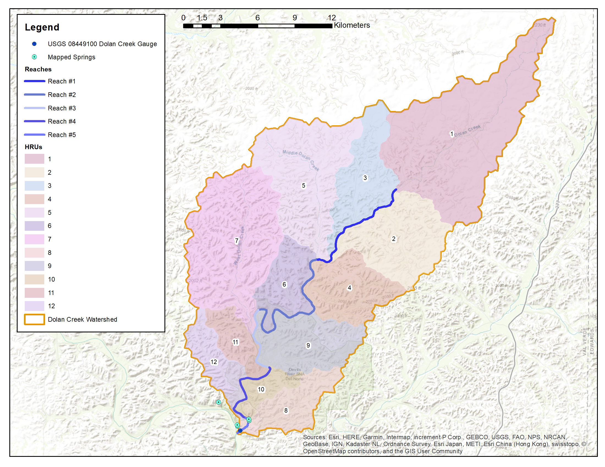
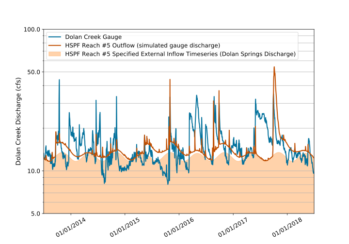

.. _standalone_HSPF:

Standalone HSPF Model 
======================

The case study application was developed to assist in pyHS2MF6 
development and testing. Consequently, there was not an existing 
HSPF model to use as a starting point. However, a standalone 
HSPF model was created expressly for testing pyHS2MF6.

**mHSP2** is the name of the standalone HSPF component of pyHS2MF6. 
The **mHSP2** code base is documented in :ref:`mHSP2`. It uses the 
same input file format as used by the 
`HSPsquared <https://github.com/respec/HSPsquared>`_ variant of HSPF.

The **mHSP2** input file for the case study is a 
`HDF5 file <https://portal.hdfgroup.org/display/knowledge/What+is+HDF5>`_. 
This `standalone mHSP2 input file <https://github.com/nmartin198/pyHS2MF6/blob/master/example_models/standalone/HSPF/DC_Subs_12_mHSP2_PreAutoCal.h5>`_  
is available on the pyHS2MF6 GitHub site.

|

.. _cs_saHSPF_model:

HSPF Model Layout and Configuration
-------------------------------------

The site watershed was divided into 12 sub-watershed, 
:abbr:`HRUs (Hydrologic Response Units)`. Each HRU has PERLND, pervious 
land, and IMPLND, impervious land, components or areas. IMPLND areas are 
composed of gravel roads and structures. Given the limited development 
in this area, the pervious land area is ``>>`` impervious land area. 

Five RCHRES, stream reach or well mixed reservoirs, are used to route 
water from the upstream-most :abbr:`HRU (Hydrologic Response Unit)` to 
the watershed outlet. RCHRES #5 is the stream segment where the stream 
gage and the springs are located.

Figure :ref:`fig_cs_sahspf` shows the HSPF model layout for the study 
site. Complete details of HSPF model configuration are available in 
the `standalone mHSP2 input file <https://github.com/nmartin198/pyHS2MF6/blob/master/example_models/standalone/HSPF/DC_Subs_12_mHSP2_PreAutoCal.h5>`_.

.. _fig_cs_sahspf:

    **HSPF model configuration**

|

.. _cs_saHSPF_calib:

Calibration
~~~~~~~~~~~~~

The goal for the standalone model is to produce Reach #5 outflow that 
approximately represents the observed Dolan Creek stream flow discharge from 
`USGS Gage 08449100 <https://waterdata.usgs.gov/tx/nwis/uv/?site_no=08449100&PARAmeter_cd=00065,00060>`_.
In the set-up for calibration, estimates of spring discharge from Dolan 
Springs and YR-70-01-701 (see Figure :ref:`fig_cs_focused_ws`) are provided 
to the HSPF model as an external time series of inflows to Reach #5.

An automated calibration process using `PEST <http://www.pesthomepage.org/>`_ 
was used to tweak watershed parameters to best reproduce the observed 
Dolan Creek stream flow. The results from this best-fit case are shown 
on Figure :ref:`fig_cs_sahspf_calib`. In this figure, the orange shaded 
area denotes the estimated, external inflow time series to Reach #5 that
represents the combination of Dolan Springs and YR-70-01-701 discharge.

.. _fig_cs_sahspf_calib:

    **Standalone HSPF Calibration**

|

.. _cs_saHSPF_osoft:

HSPF Software Packages and Conversion
----------------------------------------

The standalone HSPF model was created using the following combinations 
of HSPF-variant software.

1. The initial HSPF model set-up and configuration were implemented 
   using `PyHSPF <https://github.com/djlampert/PyHSPF>`_. This produces 
   a HSPF :abbr:`UCI (User Control Interface)` file and input and 
   output :abbr:`WDM (Watershed Data Management)` files.

2. `HSPsquared <https://github.com/respec/HSPsquared>`_ was then employed 
   to convert the :abbr:`UCI (User Control Interface)` file and input
   :abbr:`WDM (Watershed Data Management)` file to an `HSPsquared` 
   input `HDF5 file <https://portal.hdfgroup.org/display/knowledge/What+is+HDF5>`_.
   This format is similar to what is required for **mHSP2**.

3. Next, the jupyter notebook 
   `mHSP2_SetSaves.ipynb <https://github.com/nmartin198/pyHS2MF6/blob/master/example_models/jupyter_notebooks/mHSP2_SetSaves.ipynb>`_ 
   was employed to modify the `HSPsquared`, input HDF5 file to be 
   provide the specification of model outputs that is required by **mHSP2**. 

