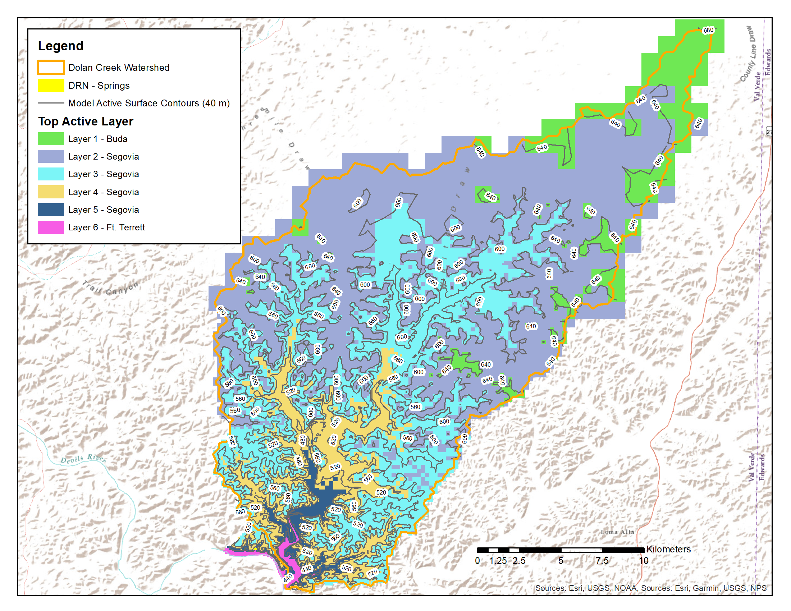
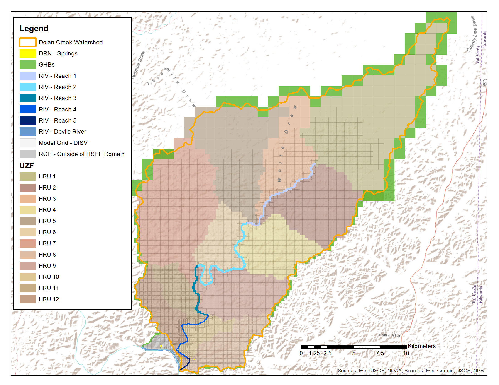
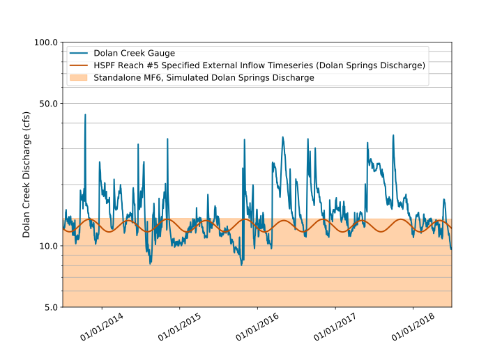

.. _standalone_MF6:

Standalone MODFLOW 6 Model 
==========================

This case study application was developed to assist in pyHS2MF6 
development and testing. There was not an existing MODFLOW 6 model 
to use as a starting point. A transient, standalone MODFLOW 6 model 
was created expressly for development and testing of pyHS2MF6.

A transient groundwater flow model is required because there is not 
a *static* version of an HSPF model. Consequently, a transient 
groundwater flow model is required for coupled mode simulation and
so the standalone mode model should also be transient.

**pyMF6** is the name of the standalone MODFLOW 6 component of pyHS2MF6. 
The **pyMF6** code base is documented in :ref:`pyMF6`. **pyMF6** has all 
of the functionality and uses all of the code base of MODFLOW 6.

The **pyMF6** input files for the case study are on the GitHub site at 
`standalone MODFLOW 6 input files <https://github.com/nmartin198/pyHS2MF6/tree/master/example_models/standalone/MF6>`_ 
These files are all standard MODFLOW 6 inputs and should work with any 
version of MODFLOW 6.

|

.. _cs_saMF6_layout:

MODFLOW 6 Model Layout and Configuration
------------------------------------------

The study area is the Dolan Creek watershed which is composed of caprock mesas
and dry arroyos. Dolan Creek is ephemeral until the lower-most stream segment,
which is just above the confluence with the Devils River. The MODFLOW 6 model
was created with seven computational layers covering the areal extent shown on
**Figure** :ref:`fig_cs_samf6_units`. A DISV-style, unstructured grid is used 
for each layer. The computational grid was created using the `USGS GridGen 
program <https://www.usgs.gov/software/gridgen-a-program-generating-unstructured-finite-volume-grids>`_.

.. _fig_cs_samf6_units:

    **MODFLOW 6 layers and hydrostratigraphy**

|

The seven computational layers are used to represent four different 
:abbr:`HSUs (hydrostratigraphic units)` of the Edwards Formation. Each 
layer is flat and cells are inactivated to form depressions for stream 
valleys and dry arroyos. This effect can be seen in the color patterns
denoting the valley bottoms in **Figure** :ref:`fig_cs_samf6_units`. 
**Table** :ref:`tab_mf6_layers` provides the computational layer 
characteristics along with the HSU that each layer represents.

|

.. _tab_mf6_layers:

.. table:: **MODFLOW 6 layers and HSUs**

    +----------+----------------+----------------------+-----------------+
    | Layer    | HSU            | Elevation Range (m)  | Typical K (m/d) |
    +==========+================+======================+=================+
    | 1        | Buda           | 685 - 635            | 0.1             |
    +----------+----------------+----------------------+-----------------+
    | 2        | Segovia        | 635 - 570            | 0.1             |
    +----------+----------------+----------------------+-----------------+
    | 3        | Segovia        | 570 - 510            | 1.0             |
    +----------+----------------+----------------------+-----------------+
    | 4        | Segovia        | 510 - 450            | 0.1             |
    +----------+----------------+----------------------+-----------------+
    | 5        | Segovia        | 450 - 420            | 1.0             |
    +----------+----------------+----------------------+-----------------+
    | 6        | Fort Terrett   | 420 - 390            | 0.05            |
    +----------+----------------+----------------------+-----------------+
    | 7        | Devils River   | 390 - 250            | 0.8             |
    +----------+----------------+----------------------+-----------------+

|

.. _cs_saMF6_bcs:

Boundary Conditions
~~~~~~~~~~~~~~~~~~~~~~

Specific boundary condition types are required in the MODFLOW 6 model 
for coupling to HSPF. The requirements are enumerated below.

1. :abbr:`UZF (Unsaturated Zone Flow)` Advanced Stress Package - required 
   for all water transfers between programs where MODFLOW receives 
   water from HSPF. The two primary cases where MODFLOW receives water 
   are deep infiltration from the bottom of the soil column and stream 
   leakage from the bottom of the stream bed.

2. :abbr:`DRN (Drain Package)` Stress Package - required to represent 
   discharge of water to the ground surface from springs.

The :abbr:`UZF (Unsaturated Zone Flow)` and :abbr:`DRN (Drain Package)` 
boundary conditions should also be used in the standalone model to 
represent pervious HRU areas, :abbr:`UZF (Unsaturated Zone Flow)`, 
and springs, :abbr:`DRN (Drain Package)`.

|

**Figure** :ref:`fig_cs_samf6_bcs` shows locations for all boundary 
condition, or stress package, types used in the standalone model. The
boundary condition types, not yet discussed, are listed below.

* :abbr:`RIV (River Package)` Stress Package - represents stream 
  segments that are represented in the HSPF model with *RCHRES* 
  structures.

* :abbr:`RCH (Recharge Package)` Stress Package - represents pervious 
  land segments that are outside of the HSPF model domain.

* :abbr:`GHB (General-Head Boundary Package)` Stress Package - provides
  or enforces a regional flow pattern at the groundwater model domain 
  edges.

.. _fig_cs_samf6_bcs:

    **Standalone model boundary conditions**

|

In **Figure** :ref:`fig_cs_samf6_bcs` the :abbr:`UZF (Unsaturated Zone Flow)`
and :abbr:`RIV (River Package)` boundary conditions are labeled according to 
corresponding HSPF structures. The MODFLOW 6 :abbr:`OBS (Observation)` package 
is used to collate and track water budget information for these identified
regions for comparison to the standalone HSPF model results as part of 
calibration.

As the standalone MODFLOW 6 model needs to be transient and water will be 
passed back and forth between HSPF and MODFLOW each simulation day in 
coupled mode, time-series records are used to specify stress package 
forcing for :abbr:`RIV (River Package)`, :abbr:`RCH (Recharge Package)`,
and :abbr:`UZF (Unsaturated Zone Flow)`. The time-series forcing is 
correlated to precipitation so that :abbr:`RCH (Recharge Package)` 
and :abbr:`UZF (Unsaturated Zone Flow)` only represent infiltration 
associated with rainfall and so that :abbr:`RIV (River Package)` 
only represents water in Reaches #1 - #4 associated with rainfall. 

It is important to provide this daily, time-series forcing in semi-arid 
environments in order to facilitate configuration of the Newton-Raphson
solver formulation. The Newton-Raphson solver will provide a better
representation of the dynamic water table movements expected for the
semi-arid, karst terrain study site.

|

Standalone Calibration 
------------------------

The focus of the calibration of this hypothetical case study model was 
to match the external inflow time series for Reach #5 in the standalone
HSPF model with simulated spring discharge from Dolan Springs and 
YR-70-01-701 (see **Figure** :ref:`fig_cs_focused_ws`). 

|

.. note:: All of the standard MODFLOW 6 capabilities are available in 
  **pyMF6**. For a *real* modeling study, the MODFLOW 6 model would also
  be calibrated to observed water levels in wells. This would be done 
  with whatever means is preferred by the modeller and could include
  PEST or other automated, parameter estimation tool.

|

**Figure** :ref:`fig_cs_samf6ca_disc` displays the match between simulated 
spring discharge in the MODFLOW 6 model and the external time series used 
to introduce spring discharge to Reach #5 in the HSPF model.

.. _fig_cs_samf6ca_disc:

    **Standalone model calibration**

|

To achieve, this level of spring discharge in the MODFLOW 6 model, a 
preferential flow pathway was added to the eastern side of the domain 
which funnels water to these springs. The location of this preferential 
pathway is shown on **Figure** :ref:`fig_cs_samf6ca_ks`.

|

.. caution:: The need for the preferential pathway is somewhat determined 
  by the domain geometry for this case study model. In this model, the 
  groundwater flow model domain is largely coincident with the Dolan 
  Creek watershed. Setting a groundwater flow model domain to be 
  coincident with the surface water watershed for the stream of interest 
  is never a good idea; the domain boundaries should always be extended 
  away from the focus area to avoid boundary effects.

|

.. _fig_cs_samf6ca_ks:
.. figure:: ./images/MF6_SA_Ks.png 
    :width: 800px
    :align: center
    :alt: Calibrated preferential pathway
    :figclass: align-center 

    **Preferential flow pathway**

|

The simulated water levels at the end of the transient, standalone, groundwater 
flow model simulation are shown on **Figure** :ref:`fig_cs_samf6ca_wlev` 
along with the depth to the water table. Simulated water levels are close to 
the ground surface in the stream valleys, especially as move downstream to 
the Reach #4 and #5 regions. Bounding the groundwater flow domain with 
the surface water watershed contributes to this effect. The shape of the 
domain is arbitrarily focusing groundwater flow to Reach #4 and #5.

.. _fig_cs_samf6ca_wlev:
.. figure:: ./images/MF6_SA_WLevResultsl.png 
    :width: 800px
    :align: center
    :alt: Calibrated standalone model, simulated water levels
    :figclass: align-center 

    **Simulated groundwater levels**

|

