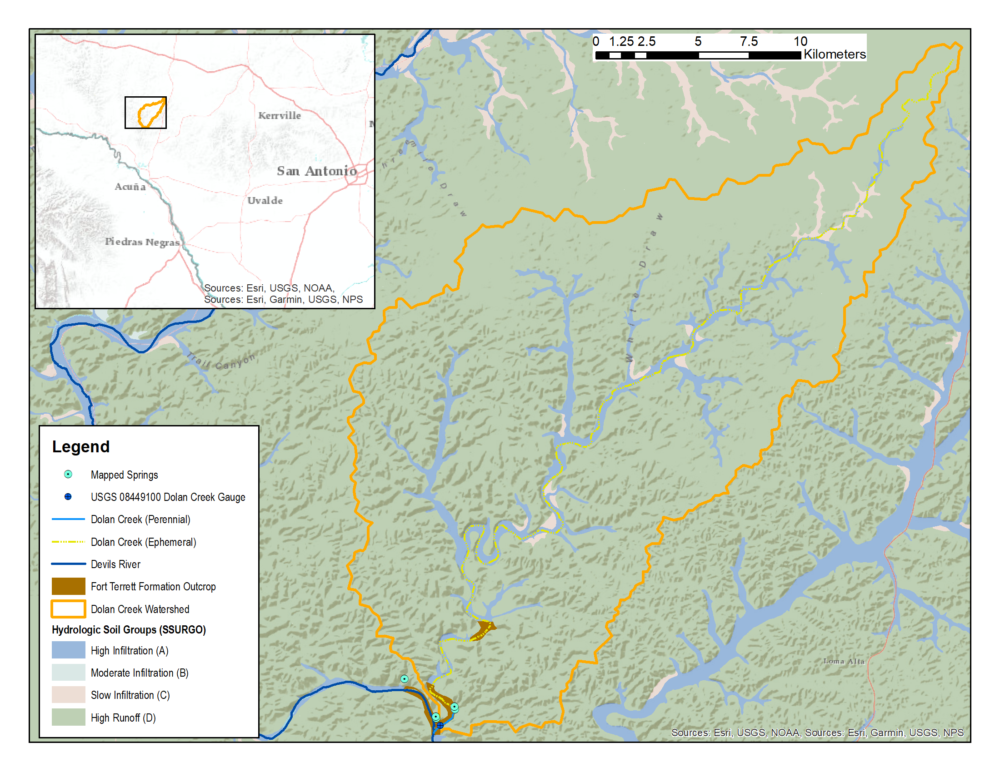
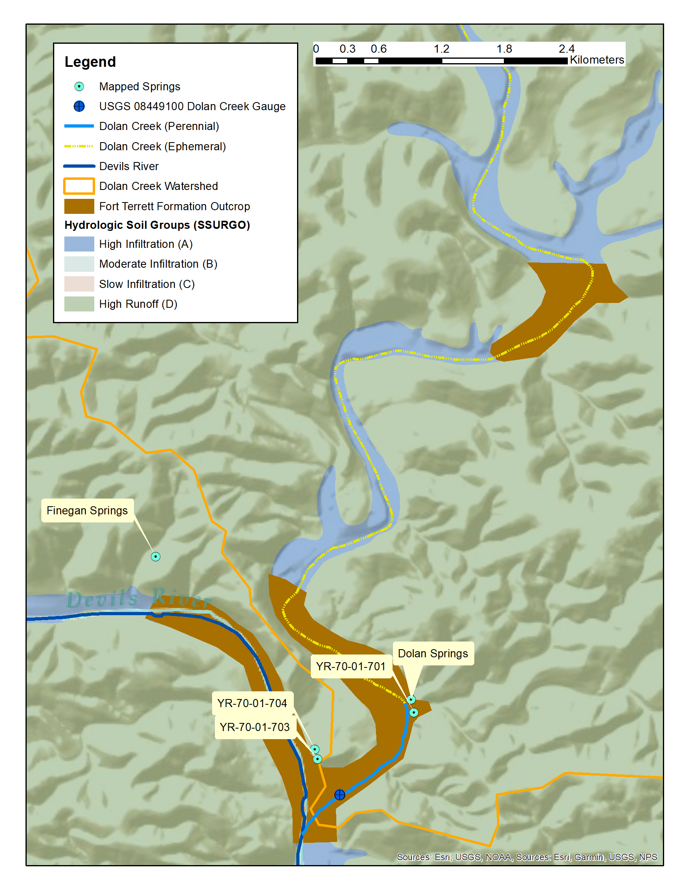
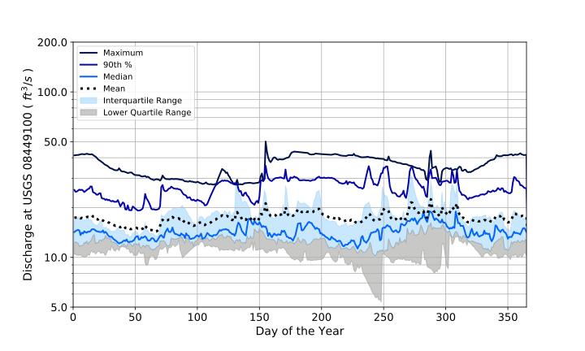

.. _study_site:

Study Site
===========

The case study site is the The 471 km\ :sup:`2` :ref:`fig_cs_watershed` in Val 
Verde County, TX, USA. 
`USGS Gage 08449100 <https://waterdata.usgs.gov/tx/nwis/uv/?site_no=08449100&PARAmeter_cd=00065,00060>`_ 
is located on Dolan Creek near the watershed outlet and the confluence of 
Dolan Creek and Devils River.

.. _fig_cs_watershed:

    **Dolan Creek watershed**

|

This stream gaging station has been in operation since November 2011. As shown 
on :ref:`fig_cs_focused_ws`, most of Dolan Creek is ephemeral with the exception of the 
downstream-most reach where a number of springs, including Dolan Springs, 
provide flow to the stream throughout the year.

.. _fig_cs_focused_ws:

    **Springs and gage location**

|

Figure :ref:`fig_cs_watershed` shows the mapped Hydrologic Soil Group
from SSURGO for the site watershed. Table :ref:`tab_ssurgo_props` 
provides a listing of the pertinent hydrologic soil properties for 
HSPF simulation considertions, also from SSURGO. The ridgetops and 
valley/mesa sides (92-93% of total watershed area) have low water 
storage and high runoff potential while the dry stream beds and valley 
bottoms (7-8% of total watershed area) provide high infiltration 
rates and near surface water storage.

|

.. _tab_ssurgo_props:

.. table:: **SSURGO soil properties**

    +------------------+-------------------+------------+---------------------+
    | Descriptor       | Value             | % of       | Notes               |
    |                  |                   | Watershed  |                     |
    +==================+===================+============+=====================+
    | Hydrologic Soil  | D                 | 92%        | Everything except   |
    | Group            |                   |            | for dry stream beds |
    |                  +-------------------+------------+---------------------+
    |                  | C                 | 1%         |                     |
    |                  |                   |            |                     |
    |                  +-------------------+------------+---------------------+
    |                  | A                 | 7%         | Dry stream beds and |
    |                  |                   |            | valley bottoms      |
    +------------------+-------------------+------------+---------------------+
    | Available Water  | 1 - 2 cm          | 88.5%      | Uplands away from   |
    | Supply           |                   |            | streambeds          |
    |                  +-------------------+------------+---------------------+
    |                  | 3 - 4 cm          | 4 %        | Valley bottoms away |
    |                  |                   |            | from stream beds    |
    |                  +-------------------+------------+---------------------+
    |                  | 10 - 23 cm        | 7.5%       | Dry stream beds     |
    +------------------+-------------------+------------+---------------------+
    | Depth to         | > 201 cm          | 8.2%       | Dry stream beds     |
    | restrictive      +-------------------+------------+---------------------+
    | layer            | 30 - 50 cm        | 53.7%      | Hillsides           |
    |                  +-------------------+------------+---------------------+
    |                  | 20 - 25 cm        | 38.1 %     | Ridgetops           |
    +------------------+-------------------+------------+---------------------+

Hydrologic Soil Types::

    D = high runoff and slow infiltration
    C = moderate runoff and slow infiltration
    A = little runoff and high infiltration rate

|

Land cover across the watershed is relatively uniform shrub/scrub. 
Development-related impervious surfaces within the watershed are limited
as there are no paved roads and only a few scattered cabins. Most of 
the watershed, 92% in Table :ref:`tab_ssurgo_props`, is naturally 
impervious due to the rocky nature of the mesa-dominated landscape.
The site watershed is in karst terrain and the high infiltration 
rate, valley bottom-areas exhibit enhanced secondary porosity from 
limestone dissolution.

In terms of surficial geology, the Dolan Creek watershed is at the 
southwestern margin of the Edwards Plateau, a resistant carbonate 
upland of nearly flat-lying limestone and dolostone with thin 
soils, caprock mesas and dry arroyos. Dolan Springs and three other 
mapped springs, in or near the site watershed, are located on an 
outcrop of the Fort Terrett limestone of the Edwards Formation. 
Conduits and caves are present in the overlying Segovia limestone 
above the contact with the Fort Terrett limestone. The majority 
of the watershed has Segovia limestone of the Edwards Formation 
mapped at the surface with the exception of a few ridgetops mapped 
as Buda limestone of the Edwards Formation.

The hypothesis for integrated hydrologic model development is that 
the Fort Terrett is relatively impermeable and spring discharge 
occurs at or associated with the contact of the Fort Terrett and 
overlying material. Additionally, the perennial portions of Dolan 
Creek coincide with locations where the creek bed crosses Fort 
Terrett outcrop.

As shown on Figures :ref:`fig_cs_watershed` and 
:ref:`fig_cs_focused_ws`, most of Dolan Creek is ephemeral with the 
exception of the downstream-most reach where a number of springs, 
including Dolan Springs, provide flow to the stream throughout the 
year. A probabilistic, day of the year discharge plot is provided 
for USGS Gage 08449100 Dolan Creek on Figure :ref:`fig_cs_dc_prob`. 
In this figure, the interquartile (25th percentile to 75th 
percentile) and lower quartile (0th percentile to 25th percentile) 
ranges suggest relatively consistent discharge across the year.
The consistent flow pattern is attributed to the dominance of spring 
discharge from Dolan Springs and YR-70-01-701 
(see Figure :ref:`fig_cs_focused_ws`) on the Dolan Creek discharge 
hydrograph.

.. _fig_cs_dc_prob:

    **Dolan Creek probabilistic discharge**

|
